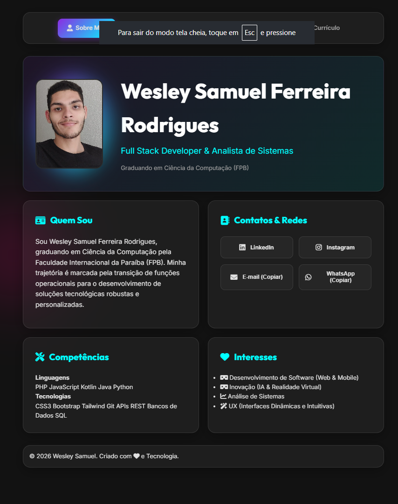
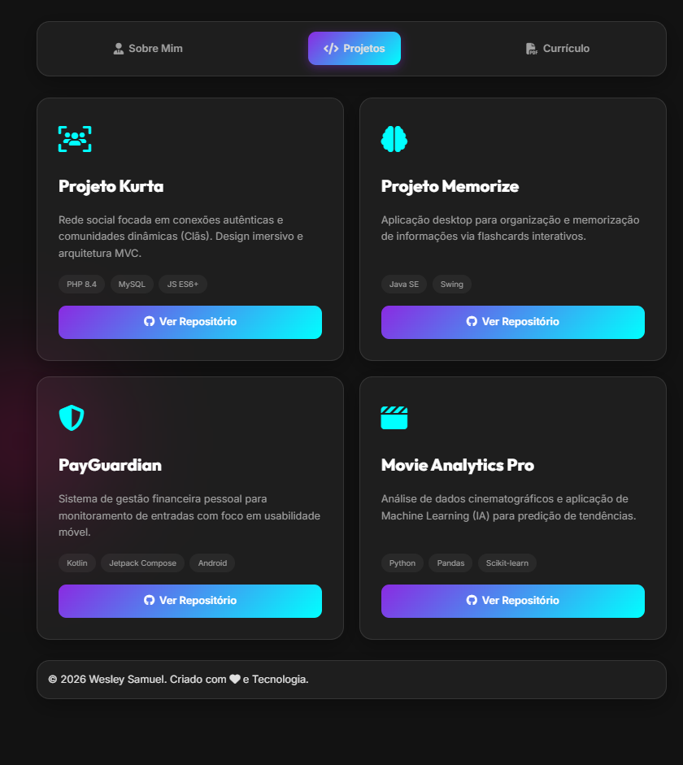
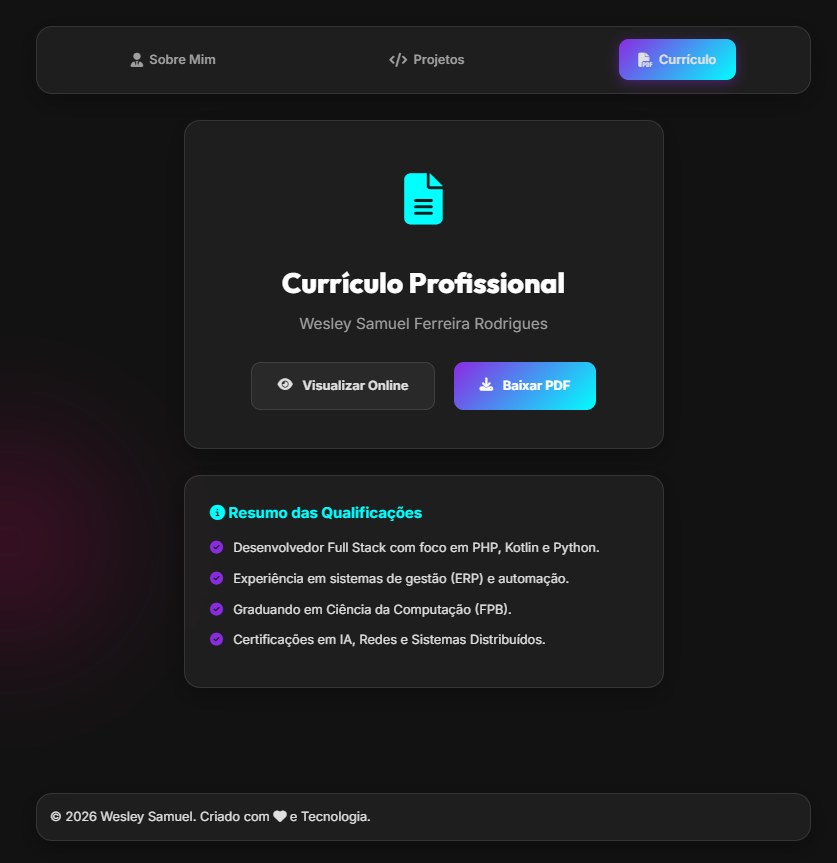

# Wesley Samuel | Portfólio Premium 🚀


O **Portfólio Premium** de Wesley Samuel é uma aplicação web de página única (SPA) desenvolvida com uma estética **Glassmorphism** moderna e imersiva. O projeto destaca a trajetória profissional como Desenvolvedor Full Stack e Analista de Sistemas, integrando projetos reais, contatos diretos e currículo em uma interface fluida.

---

## 📸 Galeria Visual

### 💻 Aba Sobre Mim
*Apresentação profissional com foto de perfil personalizada, biografia e acesso direto a redes sociais e contatos com funcionalidade de cópia rápida.*


### 📁 Aba Projetos
*Vitrine interativa exibindo projetos reais com resumos, tecnologias utilizadas e links diretos para os repositórios no GitHub.*


### 📄 Aba Currículo
*Espaço para visualização online e download do currículo profissional em formato PDF.*


---

## ✨ Funcionalidades de Destaque

- **Design Imersivo**: Interface em modo escuro (Dark Mode) com efeitos de transparência (Glassmorphism), gradientes vibrantes e fundos dinâmicos.
- **Navegação SPA (Single Page Application)**: Alternância entre as abas via JavaScript, garantindo uma experiência de navegação instantânea e fluida.
- **Sistema de Toast**: Feedback visual em tempo real através de notificações para ações como cópia de E-mail ou WhatsApp.
- **Central de Contatos**: Botões de redirecionamento para LinkedIn e Instagram, além de atalhos para cópia de dados de contato.
- **Acesso ao Currículo**: Integração direta para visualização e download de currículo profissional.
- **Responsividade Total**: Layout adaptativo para dispositivos móveis, tablets e computadores.

---

## 🛠️ Tecnologias e Ferramentas

- **Backend**: PHP 8.x (Estruturação e manipulação básica).
- **Frontend**: HTML5, CSS3 (Variáveis, Flexbox, Grid e Backdrop Filter).
- **Interatividade**: JavaScript (DOM Manipulation, Clipboard API, Animacões).
- **Bibliotecas**: FontAwesome 6 (Ícones), Google Fonts (Inter & Outfit).
- **Design System**: Estética Glassmorphism baseada em `backdrop-filter: blur`.

---

## 📂 Estrutura de Diretórios

```bash
projeto_portifolio/
├── css/
│   └── style.css       # Estilização completa e Design System
├── js/
│   └── script.js       # Lógica das tabs e sistema de cópia/notificações
├── files/
│   ├── eu.jpg          # Foto de perfil
│   └── Currículo_Samuel.pdf
├── screenshots/        # Imagens para documentação
├── index.php           # Estrutura principal da aplicação
└── README.md           # Documentação do projeto
```

---

## 🚀 Como Executar Localmente

1. Certifique-se de ter o **PHP** instalado em sua máquina.
2. Clone ou baixe este repositório.
3. No terminal, navegue até a pasta do projeto e execute:
   ```bash
   php -S localhost:8000
   ```
4. Abra o navegador e acesse `http://localhost:8000`.

---
Desenvolvido por **Wesley Samuel Ferreira Rodrigues** | 2026
